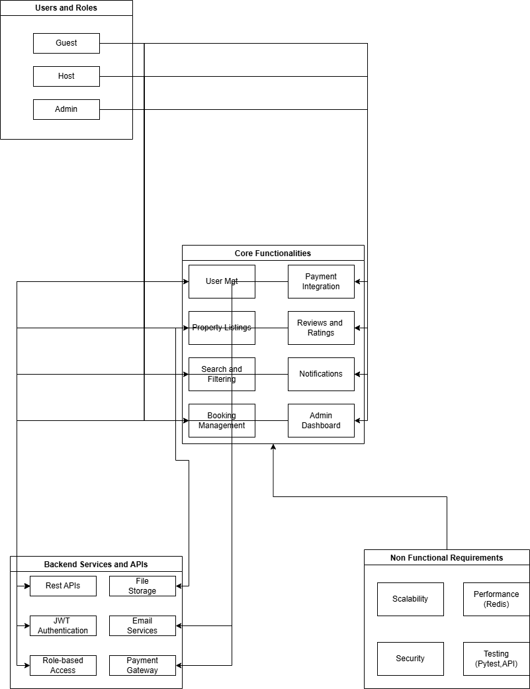

# 🧩 Airbnb Clone – Backend Features and Functionalities

This document outlines the key requirements and architectural features of the **Airbnb Clone Backend** system. It includes core functionalities, technical requirements, and non-functional expectations necessary for building a scalable and secure rental marketplace backend.

---

## 🔑 Core Functionalities

The backend must enable critical rental marketplace features:

### 1. User Management
- **User Registration**  
  - Users can sign up as **guests** or **hosts**.  
  - Secure authentication using JWT (JSON Web Tokens).  
- **User Login and Authentication**  
  - Login via email and password.  
  - Support for OAuth (Google, Facebook).  
- **Profile Management**  
  - Users can update profile photo, contact info, and preferences.

### 2. Property Listings Management
- **Add Listings**  
  - Hosts can create listings with title, description, location, price, amenities, and availability.  
- **Edit/Delete Listings**  
  - Hosts can update or remove their properties.

### 3. Search and Filtering
- Search for properties by:
  - Location  
  - Price range  
  - Number of guests  
  - Amenities (Wi-Fi, pool, pet-friendly)
- Support pagination for large result sets.

### 4. Booking Management
- **Booking Creation**  
  - Guests can book properties for specific dates.  
  - Date validation prevents double bookings.
- **Booking Cancellation**  
  - Guests and hosts can cancel bookings as per policy.
- **Booking Status**  
  - Track statuses: `pending`, `confirmed`, `canceled`, `completed`.

### 5. Payment Integration
- Integrate secure gateways (e.g., **Stripe**, **PayPal**).
- Process:
  - **Upfront payments** by guests.  
  - **Automatic payouts** to hosts after stays.
- Support **multiple currencies**.

### 6. Reviews and Ratings
- Guests can rate and review properties.
- Hosts can respond to reviews.
- Ensure reviews are linked to **completed bookings** only.

### 7. Notifications System
- Trigger **email** and **in-app notifications** for:
  - Booking confirmations  
  - Cancellations  
  - Payment updates

### 8. Admin Dashboard
- Admins can monitor and manage:
  - Users  
  - Listings  
  - Bookings  
  - Payments

---

## 🛠️ Technical Requirements

### 1. Database Management
- Use a relational database (e.g., **MySQL** or **PostgreSQL**).
- Key tables:
  - `Users` (guests and hosts)
  - `Properties`
  - `Bookings`
  - `Payments`
  - `Reviews`

### 2. API Development
- Build RESTful APIs for all backend functionalities.
- Use proper HTTP methods and status codes:
  - `GET` – retrieve data  
  - `POST` – create new data  
  - `PUT/PATCH` – update data  
  - `DELETE` – remove data
- (Optional) Use **GraphQL** for complex data queries.

### 3. Authentication and Authorization
- Use **JWT** for secure session handling.
- Implement **Role-Based Access Control (RBAC)** to manage permissions:
  - Guests  
  - Hosts  
  - Admins

### 4. File Storage
- Store property images and user profile photos using:
  - Cloud solutions (e.g., **AWS S3**, **Cloudinary**)  
  - Or local file storage (for dev scenarios)

### 5. Third-Party Services
- Use email providers like **SendGrid** or **Mailgun** for notifications.

### 6. Error Handling and Logging
- Implement **global error handling** and centralized logging for APIs.

---

## 🚀 Non-Functional Requirements

### 1. Scalability
- Modular service-based architecture.
- Enable horizontal scaling via load balancers.

### 2. Security
- Encrypt sensitive data (e.g., passwords, payment details).
- Use firewalls and apply rate limiting to protect APIs.

### 3. Performance Optimization
- Use caching solutions (e.g., **Redis**) to improve performance.
- Optimize database queries and indexing for speed.

### 4. Testing
- Implement **unit** and **integration** tests using tools like `pytest`.
- Add **automated API tests** to ensure endpoint stability.

---

## 🖼️ Visual Diagram

The image below visualizes the relationship between users, backend services, and system functionalities.

