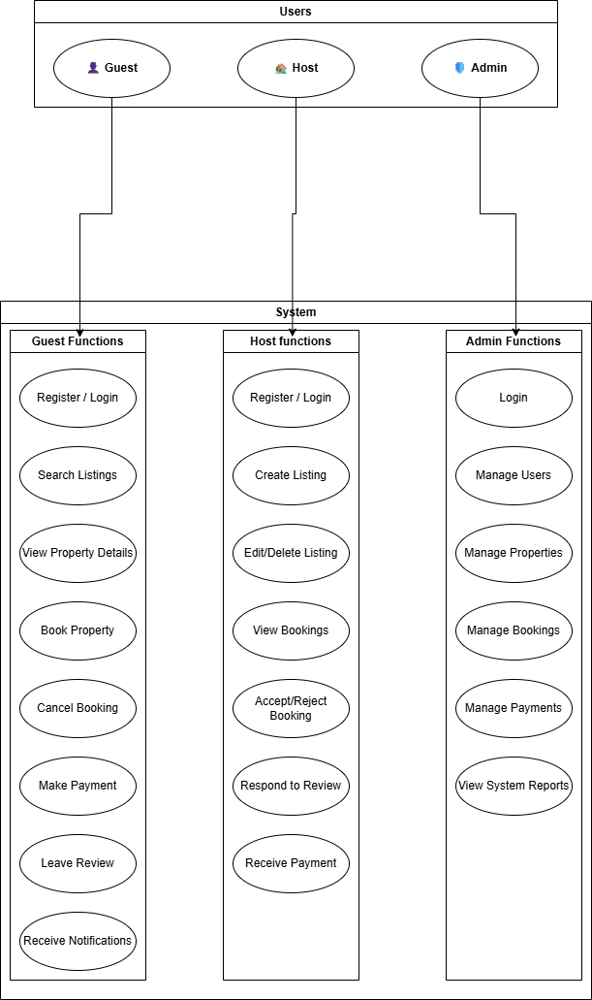

# 🎭 Airbnb Clone – Use Case Diagram

This use case diagram visually represents the core interactions between users and the backend system of the Airbnb Clone project. It identifies primary actors (Guest, Host, Admin) and maps out their roles in relation to the system’s core functionalities.

---

## 📌 Actors

- **Guest** – Can search listings, book properties, make payments, and leave reviews.
- **Host** – Can manage property listings and respond to booking requests.
- **Admin** – Has system-wide access to manage users, listings, payments, and monitor activity.

---

## 📷 Diagram Preview

